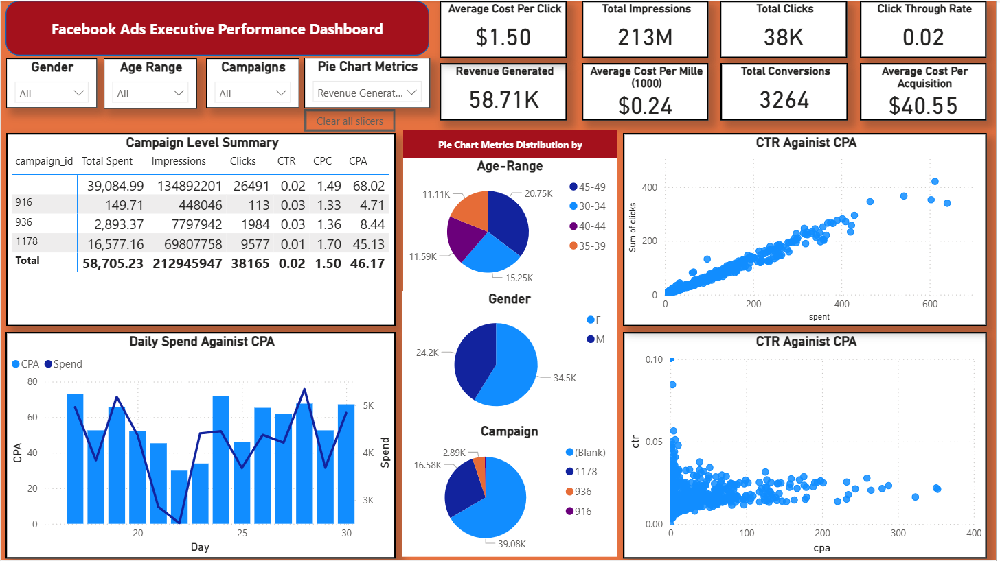
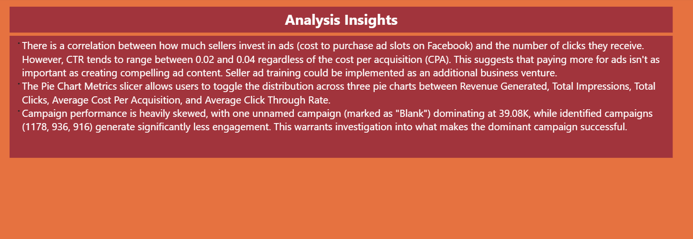

## Project Overview 
An end-to-end analytics project analyzing Facebook Ads performance data to provide actionable insights for campaign optimization. This project demonstrates the full data analytics pipeline from raw data cleaning to interactive dashboard creation.

## Business Context 
This dashboard was designed to help marketing teams and sellers understand their Facebook advertising performance across multiple dimensions including demographics, campaigns, and key performance metrics. The goal was to identify optimization opportunities and provide data-driven recommendations for improving ad ROI.

## Dataset 
- **Source**: Raw Facebook Ads performance CSV data 
- **Initial State**: Misaligned columns masking true null values 
- **Records**: Campaign-level performance data tracking spend, impressions, clicks, conversions, and demographic information
- **Key Metrics**: 
	- Total Ad Spend: $58.7K 
	- Total Impressions: 213M 
	- Total Clicks: 38K 
	- Total Conversions: 3,264 
	- Average CPA: $40.55
## Technical Pipeline 
### 1. Data Cleaning (Python) 
- Fixed column alignment issues in raw CSV data 
- Exposed and handled true null values 
- Prepared data for normalization and database ingestion
### 2. Data Normalization (PostgreSQL) 
- Designed normalized table structure to eliminate redundancy 
- Built scalable schema for future analysis with larger datasets
### 3. SQL Views (PostgreSQL) 
- Created aggregation views for performance metrics. 
- Handled complex calculations at the database layer.
- Optimized query performance for dashboard consumption.
### 4. Dashboard Development (Power BI) 
- Connected Power BI to PostgreSQL database. 
- Leveraged what I had learnt from sql views (later discussed) for straightforward dashboard creation.
- Implemented interactive visualizations and drill-through capabilities.

## Key Insights 
### 1. Creative Quality Over Budget 
- Strong correlation exists between ad spend and clicks - However, CTR remains consistent (0.02-0.04) regardless of CPA 
- **Recommendation**: Focus on improving ad creative quality rather than simply increasing budget 
- **Business Opportunity**: Implement seller ad training as an additional revenue stream
### 2. Demographic Performance 
- **45-49 age range** generates highest engagement (~21K) 
- **30-34 age range** follows closely (15.25K) 
- **40-44 age group** shows notably lower engagement (11.59K) 
- **Recommendation**: Focus targeting efforts on 30-49 demographic, particularly 45-49 segment
### 3. Gender Distribution 
- Female users generate slightly higher engagement (34.5K vs 24.2K) -
- Opportunity for gender-specific campaign optimization 
### 4. Campaign Concentration 
- One unnamed campaign dominates performance (39.08K) 
- Identified campaigns (1178, 936, 916) generate significantly less engagement
- **Action Item**: Investigate success factors of dominant campaign for replication 

## Technical Stack 
- **Data Cleaning**: Python (Pandas) 
- **Database**: PostgreSQL 
- **Data Visualization**: Power BI 
- **Key Power BI Features**: 
	- Field Parameters for dynamic measure switching 
	- DAX measures for calculated metrics 
	- Custom visualizations and drill-through pages 
	- Interactive slicers and filters
## Lessons Learned 
1. **Data quality is foundational**: Fixing column alignment issues early prevented downstream analysis problems 
2. **Database-first approach**: Handling aggregations in SQL views made Power BI development straightforward and performant 
3. **Normalization pays off**: Creating demographic features enables deeper analysis as datasets grow 
4. **Interactivity enhances insights**: Field Parameters provide flexible exploration without cluttering the dashboard 
## Future Enhancements 
- [ ] Add time-series forecasting for ad spend optimization
- [ ] Implement automated anomaly detection for campaign performance 
- [ ] Create geographic analysis layer 
- [ ] Build machine learning model for CPA prediction 
- [ ] Add sentiment analysis from ad comments/reactions 
- [ ] Develop automated reporting and alerting system

## Implementation.
- If starting with `data.csv`, first run `initial-analysis.ipynb` to fix data misalignment issues, however `data-fixed.csv` is present in the repository.
- Next create a local postgres database and run `create-tables.sql` to populate it.
	- ### `campaigns`
		- Stores each unique marketing campaign.
		- Links to all ads belonging to the campaign.
		- Used for campaign-level reporting and grouping
	- ### `ads`
		- Stores each individual ad creative/unit.
		- Connected to a specific campaign.
		- Used for ad-level performance analysis and comparisons.
	
	- ###  `audience_segments`
		- Stores unique audience targeting combinations.
		- Includes age, gender, and interests 1–3.
		- Used to analyze performance by demographic and interests.
	
	- ### `ad_performance`
		- Main fact table containing performance metrics.
		- One record = ad × audience segment × date range.
		- Stores impressions, clicks, spend, total conversions, and approved conversions.
		- Basis for all KPI calculations and trend analysis.
	- ### `staging_raw_data`
		- Temporary landing table for raw CSV uploads.
		- Holds unprocessed data exactly as it appears in the file.
		- Used for cleaning, validation, and populating normalized tables.

- Next run `etl.sql` to insert data into the various tables made in the previous step
- Lastly run `analysis.sql` to create 7 views that greatly help with analysis and creating a deeper understanding on the data, they are:
	- `vw_performance_complete` 
		- Denormalizes all key tables: ad performance, ads, campaigns, audience segments.
		- Produces a single wide table containing all raw metrics + calculated KPIs.
		- Useful for dashboards, exploratory analysis, and data science feature engineering.
		- Includes CTR, CPC, CPA, conversion rate, approval rate, and CPM.
	- `vw_campaign_summary`
		- Aggregates ad-level performance up to the campaign level.
		- Gives total impressions, clicks, conversions, spend, CTR, CPC, CPA, etc.
		- Identifies campaign time span, number of ads, unique segments targeted.
		- Useful for campaign performance monitoring and reporting.
	- `vw_ad_summary`
		- Summarizes performance for each ad across all days and segments.
		- Provides total impressions, clicks, conversions, CPA, CTR, avg daily spend.
		- Includes activity metrics like days active and segments targeted.
		- Enables quick comparison of ads within or across campaigns.
	- `vw_audience_performance`
		- Shows performance per audience segment.
		- Breaks down impressions, clicks, conversions, spend by segment attributes.
		- Calculates average CTR, conversion rate, and CPA across segment instances.
		- Useful for audience optimization and identifying high-value cohorts.
	- `vw_daily_trends`
		- Summarizes platform-wide performance by day.
		- Tracks daily spend, impressions, clicks, conversions, CTR, CPA.
		- Shows number of active ads and campaigns each day.
		- Used for trend analysis, pacing, anomaly detection.## 
	- `vw_ad_performance_ranking`
		- Computes aggregated performance metrics per ad.
		- Ranks ads within each campaign by CPA, CTR, conversion rate, conversions.
		- Adds percentile scores, top/middle/bottom performance tiers.
		- Provides flags: “High Performer”, “Underperformer”, “Average”.
		- Enables ranking-based optimization and leadership reporting.
	- ## `vw_campaign_top_bottom_ads`
		- Extracts top 5 and bottom 5 ads per campaign based on CPA.
		- Shows performance position ("Top 1", "Bottom 3", etc.).
		- Useful for rapid campaign health checks and weekly reporting.
	- ## `vw_interest_analysis`
		- Counts how often each interest appears across all segments in performance data.
		- Unifies interest_1, interest_2, interest_3 into one frequency table.
		- Useful for discovering dominant interests and planning targeting strategy.
- Finally connect to PowerBi for visualization, note the views aren't directly used for visualizing because of their relationship but because of the analysis in sql and the rather small nature of the dataset it is easy to create a meaningful dashboard.
